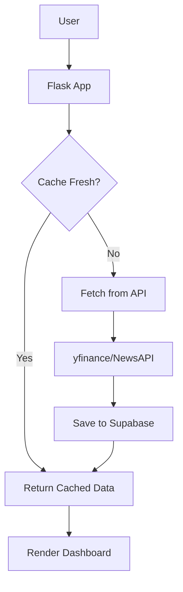
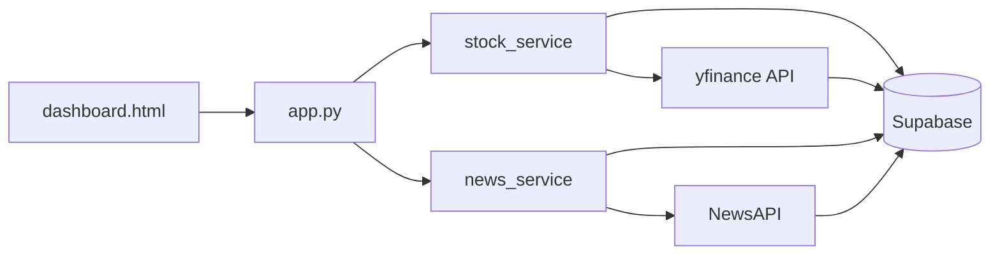

# Project: My Awesome App

## Project Description
This will be a personal finance tracking and AI hobby exploration site. It is part of a bigger hobby-website project, and will be part of that eco-system. It will however be stand-alone, with option for connecting to API's, AI models and have webscrape for news. 

The project wil will be a dashboard showing stock price (as live as possible), Top news stories (pulled from API). And the website should have AI generated commentary on buy ideas or macro data insights. 

This file will guide your thoughts, adhere to the principles and re-read these instructions carefully often. 

## Tech Stack (proposed, do not overthink this yet)
- **Frontend**: Flask with Jinja2 templates, HTML/CSS, Bootstrap
- **Backend**: Python 3.x, Flask web framework
- **Database**: PostgreSQL (primary production) + Parquet files (portable backup)
- **Data Processing**: Pandas, NumPy for data manipulation and analysis
- **API Integration**: public live data free websites. 
- **Data Formats**: Parquet (columnar compression), CSV exports
- **Testing**: pytest (recommended for future unit tests)

Files are hosted in a VPS hosted in hostinger under the name "ai-vearkstedet.cloud". 


## Code Conventions
- 4-space indentation (Python PEP 8 standard)
- `snake_case` for variables, functions, and file names
- `UPPER_SNAKE_CASE` for constants
- `CapitalCase` for class names
- Type hints for all function signatures
- Google-style docstrings for all public functions
- Comments explaining complex logic and API quirks
- Error handling with try/except for API calls and database operations

## Project Structure
```
Finance dashboard/
├── app.py                  # Main Flask application
├── config.py               # Configuration (API keys, settings)
├── requirements.txt        # Python dependencies
├── Dockerfile             # Container deployment
├── .env                   # Environment variables (not in git)
├── database/
│   ├── schema.sql         # Supabase database schema
│   ├── supabase_service.py # Database operations
│   └── CLAUDE.md          # Database documentation
├── services/
│   ├── stock_service.py   # Stock data fetching & caching
│   ├── news_service.py    # News fetching & caching
│   ├── api_utils.py       # Shared API utilities
│   └── CLAUDE.md          # Services documentation
├── templates/
│   └── dashboard.html     # Main dashboard UI
├── static/
│   └── (CSS/JS assets)
├── tests/
│   ├── test_*.py          # Unit tests
│   └── README.md          # Testing guide
└── archive/               # Deprecated/unused files
```

## Database Schema

**Supabase PostgreSQL Tables:**

1. **`stocks`** - Historical stock price data
   - `ticker`, `price`, `change_percent`, `high`, `low`, `volume`
   - `timestamp`, `created_at`
   - Indexes: ticker, timestamp, ticker+timestamp

2. **`news`** - Cached financial news articles
   - `title`, `summary`, `url` (unique), `source`
   - `published_at`, `fetched_at`, `created_at`
   - Indexes: published_at, source
   - TTL: 1 hour (refresh via cache logic)

3. **`company_info`** - Cached company metadata
   - `ticker` (PK), `company_name`, `sector`, `industry`
   - `market_cap`, `pe_ratio`, `description`, `website`
   - `last_updated`, `created_at`
   - TTL: 24 hours (via `is_company_info_stale()` function)

4. **`ai_insights`** - AI-generated market commentary
   - `content`, `insight_type`, `generated_at`, `created_at`
   - Indexes: generated_at, insight_type

## Current Features

✅ **Stock Dashboard**: Real-time stock prices via yfinance  
✅ **Company Info Caching**: 24hr cache to reduce API calls  
✅ **Financial News**: NewsAPI integration with 1hr cache  
✅ **Interactive Charts**: Chart.js visualization  
✅ **Health Monitoring**: `/health` endpoint for deployment  

## Important Notes
- All data fetching uses cache-first strategy to minimize API calls
- yfinance: Free, no API key required
- NewsAPI: 100 requests/day free tier
- Supabase: PostgreSQL hosted database
- All timestamps are timezone-aware (TIMESTAMPTZ)

## Known Issues
- NewsAPI sometimes returns null title/description (handled with `or ''` fallback)
- Duplicate news URLs expected (unique constraint prevents duplicates)
- Chart.js lint errors in templates are false positives (Jinja2 syntax)

## Future Plans
- Chart time period selector (1D-5Y)
- NASDAQ 500 stock search/selector
- Market indexes table (S&P 500, NASDAQ, DOW)
- AI-generated buy/sell insights
- WebSocket for live stock updates

## Instructions for Claude

When working on this project, please:

- **Be concise**: Brevity is preferred over verbosity. Keep responses short and direct.
- **Always write unit tests**: Every feature must have comprehensive unit tests to detect and treat errors early.
- **Challenge assumptions**: Question if the user's approach might have issues or if there's better logic available.
- **Ask for clarity**: Request elaboration when instructions are vague or where context could provide significant additional value.
- **Strive for simplicity**: Prefer simple solutions over complex ones; prevent unnecessary file proliferation.
- **Archive aggressively**: Move unused files to `archive/`, delete empty folders, consolidate test scripts.
- **Minimize documentation**: Keep docs in `CLAUDE.md` files only; use folder-specific `CLAUDE.md` only for complex directories.
- **Type everything**: Always include Python type hints for all function parameters and return values.
- **Follow existing patterns**: Use established error handling, database query patterns, and API integration approaches.
- **Document public functions**: Include comprehensive docstrings for all public functions and classes.
- **Cache-first strategy**: All external API calls should check cache before fetching.
- **Production mindset**: Treat this as production code; consider edge cases, error handling, and data integrity.

## Environment Setup

Required `.env` variables:
```
NEWS_API_KEY=your_newsapi_key_here
NEWS_API_SOURCE=newsapi
SUPABASE_URL=https://your-project.supabase.co
SUPABASE_KEY=your_supabase_anon_key
```

## Architecture Diagrams

## Application Flow



## Data Architecture

