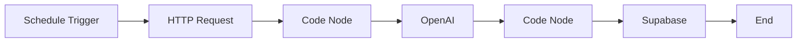

# n8n AI Analysis Workflow Setup

## Overview
This document guides you through setting up an n8n workflow that fetches stock and news data from your Finance Dashboard, generates AI analysis using OpenAI, and stores insights back to Supabase.

## Prerequisites
- n8n instance (cloud or self-hosted)
- n8n API Key: `eyJhbGciOiJIUzI1NiIsInR5cCI6IkpXVCJ9...` (stored in .env)
- OpenAI API Key (for AI analysis)
- Finance Dashboard running at `http://127.0.0.1:5002`

## Workflow Architecture



## Step-by-Step Setup

### Step 1: Create New Workflow
1. Log into your n8n instance
2. Click "New Workflow"
3. Name it: "Finance AI Analysis - Hourly"

### Step 2: Add Schedule Trigger
1. Add node: **Schedule Trigger**
2. Configure:
   - **Trigger Interval**: Day
   - **Trigger at Hour**: 9 (9 AM, adjust to your timezone)
   - **Trigger at Minute**: 0
   - **Note**: Runs once daily at 9:00 AM

### Step 3: Add HTTP Request Node
1. Add node: **HTTP Request**
2. Configure:
   - **Method**: GET
   - **URL**: `http://your-vps-ip-or-domain/api/analysis-data`
     - Replace with your actual VPS domain (e.g., `http://ai-vearkstedet.cloud/api/analysis-data`)
     - Or use internal IP if n8n is on same VPS: `http://localhost:5002/api/analysis-data`
   - **Query Parameters**:
     - `ticker`: `META` (or use expression for dynamic ticker)
     - `news_limit`: `5`
   - **Options** → **Response**:
     - **Response Format**: JSON

**Output Preview:**
```json
{
  "ticker": "META",
  "timestamp": "2025-11-02T10:00:00",
  "stock": {
    "company_name": "Meta Platforms Inc",
    "current_price": 450.25,
    "change_percent": 2.3,
    ...
  },
  "news": [...],
  "prompt_template": "..."
}
```

### Step 4: Add Code Node (Format Prompt)
1. Add node: **Code**
2. Configure:
   - **Mode**: Run Once for All Items
   - **Language**: JavaScript

**Code:**
```javascript
// Extract data from HTTP request
const data = $input.first().json;

// Build news context from articles
const newsContext = data.news.map((article, index) => 
  `${index + 1}. ${article.ai_context}`
).join('\n\n');

// Replace {{news_context}} in template
const prompt = data.prompt_template.replace('{{news_context}}', newsContext);

// Return formatted prompt
return [{
  json: {
    ticker: data.ticker,
    stock: data.stock,
    prompt: prompt,
    timestamp: data.timestamp
  }
}];
```

### Step 5: Add OpenAI Node
1. Add node: **OpenAI**
2. Configure:
   - **Resource**: Message
   - **Operation**: Create
   - **Model**: gpt-4o-mini (or gpt-3.5-turbo for lower cost)
   - **Messages**:
     - **Role**: User
     - **Content**: `={{ $json.prompt }}`
   - **Options** → **Response Format**: JSON Object
   - **Options** → **Max Tokens**: 500

**Expected AI Output:**
```json
{
  "sentiment": "bullish",
  "key_factors": ["Strong earnings", "Positive news coverage"],
  "outlook": "Positive short-term momentum expected",
  "risk_level": "medium"
}
```

### Step 6: Add Code Node (Parse AI Response)
1. Add node: **Code**
2. Configure:
   - **Mode**: Run Once for All Items

**Code:**
```javascript
const previousData = $input.first().json;
const aiResponse = previousData.message.content;

// Parse AI response (already JSON)
const analysis = typeof aiResponse === 'string' 
  ? JSON.parse(aiResponse) 
  : aiResponse;

// Prepare data for Supabase
return [{
  json: {
    ticker: previousData.ticker,
    content: JSON.stringify(analysis),
    sentiment: analysis.sentiment,
    risk_level: analysis.risk_level,
    insight_type: 'daily'
  }
}];
```

### Step 7: Add Supabase Node
1. Add node: **Supabase**
2. Configure:
   - **Resource**: Row
   - **Operation**: Insert
   - **Table**: ai_insights
   - **Data to Send**: Define Below
   - **Fields**:
     - **ticker**: `={{ $json.ticker }}`
     - **content**: `={{ $json.content }}`
     - **sentiment**: `={{ $json.sentiment }}`
     - **risk_level**: `={{ $json.risk_level }}`
     - **insight_type**: `={{ $json.insight_type }}`

**Supabase Credentials:**
- **Host**: Your Supabase project URL
- **Service Role Secret**: Your Supabase service role key (from .env)

### Step 8: Activate Workflow
1. Click **Save** (top right)
2. Toggle **Active** (top right)
3. Click **Execute Workflow** to test manually

## Testing the Workflow

### Manual Test (Recommended First)
1. Click **Execute Workflow** button
2. Watch each node execute
3. Check node outputs for errors
4. Verify data in Supabase `ai_insights` table

### Check Database
```sql
SELECT * FROM ai_insights 
ORDER BY generated_at DESC 
LIMIT 5;
```

### Test from Dashboard
After successful n8n run:
```powershell
.\venv\Scripts\python.exe app.py
```
Visit: `http://127.0.0.1:5002`

## Troubleshooting

**HTTP Request fails:**
- Ensure Flask app is running on port 5002
- Check URL is accessible: `curl http://127.0.0.1:5002/api/analysis-data`

**OpenAI node errors:**
- Verify OpenAI API key is valid
- Check you have API credits
- Try gpt-3.5-turbo if gpt-4 fails

**Supabase insert fails:**
- Verify service role key permissions
- Check table schema matches field names
- Ensure ticker column exists in ai_insights table

**No AI output on dashboard:**
- Query Supabase to verify data inserted
- Check `get_latest_ai_insight()` function
- Verify dashboard route fetches AI insights

## Cost Estimation

**OpenAI (gpt-4o-mini):**
- ~$0.002 per analysis
- 1 analysis/day = ~$0.002/day
- **~$0.06/month** (30 days)

**n8n (Self-hosted on VPS):**
- Free (already have VPS)
- This workflow: 30 executions/month

## Advanced: Dynamic Ticker Selection

To analyze multiple stocks, modify Step 2:

**HTTP Request URL:**
```
http://127.0.0.1:5002/api/analysis-data?ticker={{ $json.ticker }}
```

**Add preceding Code node with ticker list:**
```javascript
const tickers = ['META', 'AAPL', 'GOOGL', 'MSFT', 'NVDA'];
return tickers.map(ticker => ({ json: { ticker } }));
```

This will run the workflow for each ticker sequentially.

## Next Steps

After successful integration:
1. Update dashboard to display AI insights
2. Add sentiment indicators (🟢 bullish, 🔴 bearish, 🟡 neutral)
3. Create AI insights history page
4. Add email alerts for high-risk assessments
5. Implement multi-ticker analysis
