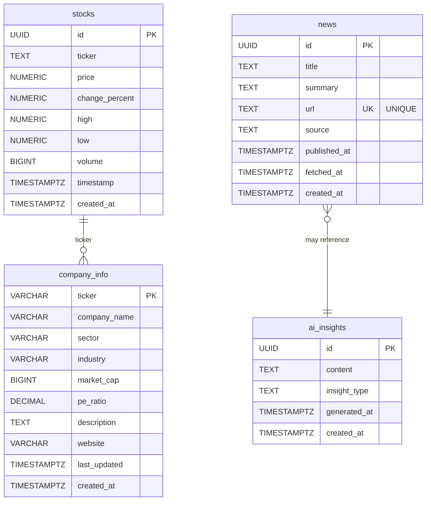

# Database Module

## Overview
Supabase PostgreSQL database service for Finance Dashboard. Handles all database operations with connection pooling and error handling.

## Database Schema Visualization



**Cache TTLs:**
- `stocks`: 30 days (auto-cleanup)
- `news`: 1 hour (app-level) / 7 days (DB cleanup)
- `company_info`: 24 hours (via `is_company_info_stale()`)
- `ai_insights`: 30 days (auto-cleanup)

## Files
- `schema.sql` - Complete database schema with tables, indexes, and helper functions
- `supabase_service.py` - Python service layer for database operations

## Database Tables

### `stocks`
Historical stock price data with high-frequency writes.

**Schema:**
```sql
ticker TEXT, price NUMERIC(10,2), change_percent NUMERIC(6,2),
high NUMERIC(10,2), low NUMERIC(10,2), volume BIGINT,
timestamp TIMESTAMPTZ, created_at TIMESTAMPTZ
```
**Indexes:** ticker, timestamp, ticker+timestamp  
**Cleanup:** Auto-delete after 30 days

### `news`
Cached financial news articles from NewsAPI.

**Schema:**
```sql
title TEXT, summary TEXT, url TEXT UNIQUE,
source TEXT, published_at TIMESTAMPTZ,
fetched_at TIMESTAMPTZ, created_at TIMESTAMPTZ
```
**Indexes:** published_at, source  
**Cache TTL:** 1 hour (application-level)  
**Cleanup:** Auto-delete after 7 days  
**Note:** URL unique constraint prevents duplicates

### `company_info`
Cached company metadata from yfinance.

**Schema:**
```sql
ticker VARCHAR(10) PRIMARY KEY, company_name VARCHAR(255),
sector VARCHAR(100), industry VARCHAR(100), market_cap BIGINT,
pe_ratio DECIMAL(10,2), description TEXT, website VARCHAR(255),
last_updated TIMESTAMPTZ, created_at TIMESTAMPTZ
```
**Indexes:** last_updated  
**Cache TTL:** 24 hours (via `is_company_info_stale()` function)  
**Helper:** `is_company_info_stale(ticker)` returns boolean

### `ai_insights`
AI-generated market commentary (future feature).

**Schema:**
```sql
content TEXT, insight_type TEXT,
generated_at TIMESTAMPTZ, created_at TIMESTAMPTZ
```
**Indexes:** generated_at, insight_type  
**Cleanup:** Auto-delete after 30 days

## Key Functions in supabase_service.py

**Stock Operations:**
- `insert_stock_data(ticker, data)` - Insert stock price record
- `get_latest_stock_data(ticker)` - Get most recent price

**News Operations:**
- `insert_news_article(article)` - Insert/update news (handles duplicates)
- `get_cached_news(category, limit, max_age)` - Retrieve fresh news from cache

**Company Info Operations:**
- `insert_company_info(ticker, info)` - Upsert company metadata
- `get_company_info(ticker)` - Retrieve cached company info
- `is_company_info_fresh(ticker, max_age_hours)` - Check cache freshness

## Cache Strategy

All external API calls follow cache-first pattern:
1. Check database for fresh data
2. Return cached if within TTL
3. Fetch from API if stale/missing
4. Save to database
5. Return fresh data

## Connection Management

Uses Supabase client with automatic connection pooling. Credentials from `config.py`:
- `SUPABASE_URL`
- `SUPABASE_KEY`

## Error Handling

All database operations wrapped in try/except:
- Log errors with context
- Return `None` or empty list on failure
- Graceful degradation (app continues without cache)

## Testing

Run: `.\venv\Scripts\python.exe -m pytest tests/test_company_info_cache.py -v`

Tests cover:
- Cache miss → cache hit flow
- Freshness checks
- Multiple tickers
- Database storage verification
